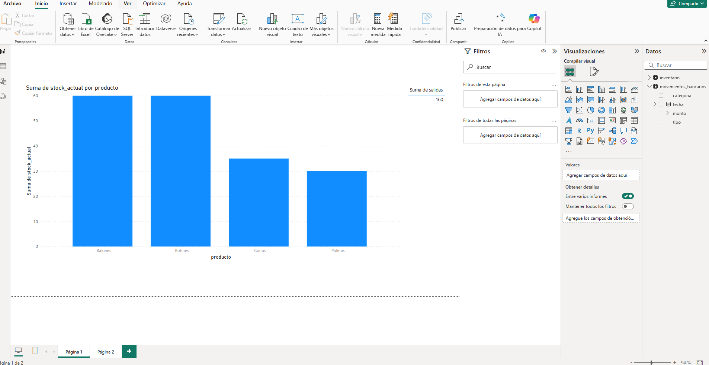
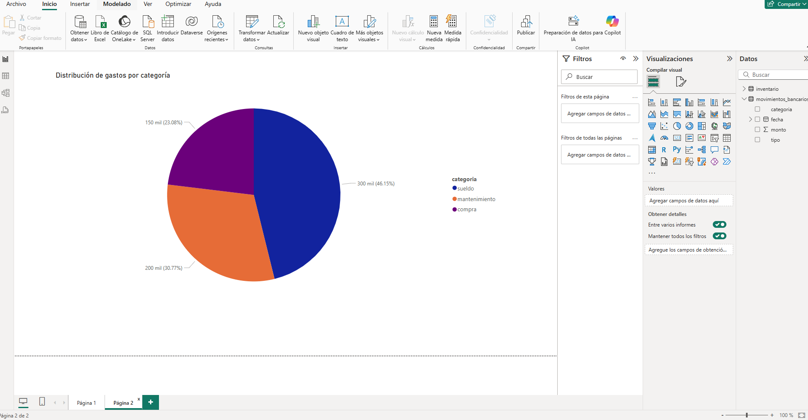

 # 📊 Análisis de Inventario y Flujo de Caja con Python + Power BI

Este proyecto simula el análisis de inventario y finanzas operativas de una bodega municipal utilizando **Python, SQL y Power BI**, reflejando una experiencia real aplicada a automatización de reportes y control financiero.

## 🧰 Herramientas utilizadas
- Python (Pandas, Matplotlib)
- Power BI Desktop
- Git + GitHub
- CSV como fuente de datos

## 📦 Módulo 1 – Análisis de Inventario
- Lectura de datos desde `inventario.csv`
- Cálculo de stock actual y variación por producto
- Visualización en gráfico de columnas (Power BI)

## 💰 Módulo 2 – Análisis de Flujo de Caja
- Lectura de `movimientos_bancarios.csv`
- Cálculo de ingresos, egresos y saldo final
- Gastos agrupados por categoría
- Visualización con gráfico de pastel

## 📸 Capturas del dashboard

### Inventario por producto

### Gastos por categoría

## 📁 Estructura del proyecto
📂 inventario_finanzas_analisis
├── data/
│ ├── inventario.csv
│ └── movimientos_bancarios.csv
├── scripts/
│ ├── analisis_inventario.py
│ └── flujo_caja.py
├── powerbi/
│ └── dashboard_inventario_flujo.pbix

└── README.md

## 👨‍💻 Autor
Cristian Carlos Velásquez Cornejo  
[LinkedIn](https://www.linkedin.com/in/cristian-carlos-velasquez-cornejo-aab80a325) 
[GitHub](https://github.com/cristian102711)
